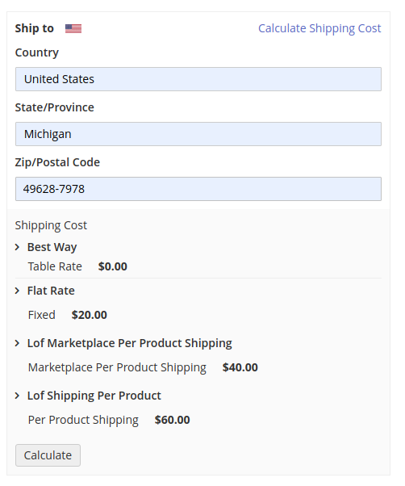
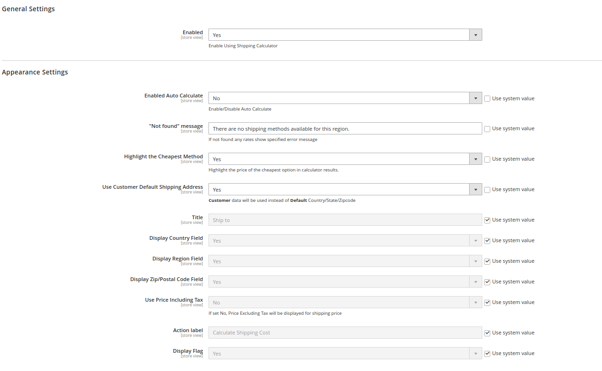

# Magento 2 Module Lof ShippingCalculator

    ``landofcoder/module-shippingcalculator``

 - [Main Functionalities](#markdown-header-main-functionalities)
 - [Installation](#markdown-header-installation)
 - [Configuration](#markdown-header-configuration)
 - [Specifications](#markdown-header-specifications)
 - [Attributes](#markdown-header-attributes)

## Main Functionalities
- Show Shipping Cost Calculator on Product page
- Allow buyer check estimate shipping cost on product before purchase

## Installation
\* = in production please use the `--keep-generated` option

### Type 1: Zip file

 - Unzip the zip file in `app/code/Lof`
 - Enable the module by running `php bin/magento module:enable Lof_ShippingCalculator`
 - Apply database updates by running `php bin/magento setup:upgrade`\*
 - Deploy static files by running `php bin/magento setup:static-content:deploy -f`\*
 - Flush the cache by running `php bin/magento cache:flush`

### Type 2: Composer

 - Install the module composer by running `composer require landofcoder/module-shippingcalculator`
 - enable the module by running `php bin/magento module:enable Lof_ShippingCalculator`
 - apply database updates by running `php bin/magento setup:upgrade`\*
 - Deploy static files by running `php bin/magento setup:static-content:deploy -f`\*
 - Flush the cache by running `php bin/magento cache:flush`

## Configuration

Go to admin > Stores > Configuration > Landofcoder > Shipping Calculator

# Support

If you encounter any problems or bugs, please <a href="https://github.com/landofcoder/module-shipping-cost-calculator/issues">open an issue</a> on GitHub.

# Screenshots

<h3>Shipping Cost Calculator in Product Page</h3>

<h3>Configuration</h3>

## Donation

If this project help you reduce time to develop, you can give me a cup of coffee :) 

